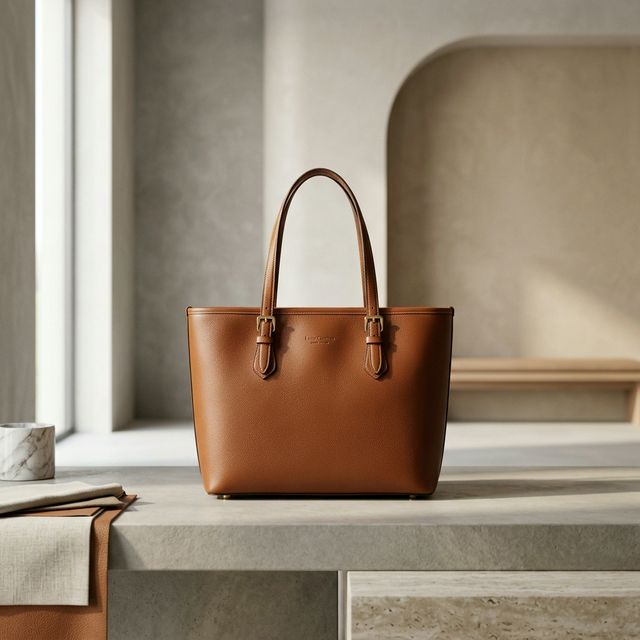

# 3D Bag Customizer

A premium, interactive 3D web application allowing users to customize luxury bags in real-time. Built with **Next.js**, **React Three Fiber (Three.js)**, **GSAP**, and **Zustand**.



## Features

- **Real-time 3D Customization**: Seamlessly switch between different bag models (Tote, Backpack, Messenger, etc.).
- **Material & Color Control**: Customize individual components including the bag body, straps, and hardware (zippers/buckles).
- **Personalized Branding**: Upload your own monograms or decals with full control over scale and positioning on the 3D model.
- **Interactive UI**: Sleek, accordion-based configuration panel with glassmorphism effects.
- **High Fidelity**: Smooth GSAP-powered transitions and high-quality PBR materials.
- **Design Export**: Download your custom creation as a high-resolution PNG directly from the 3D scene.
- **Cart Integration**: Add your customized designs to a shopping bag with calculated pricing.

## Tech Stack

- **Framework**: [Next.js](https://nextjs.org/)
- **3D Engine**: [Three.js](https://threejs.org/) via [React Three Fiber](https://docs.pmnd.rs/react-three-fiber/getting-started/introduction)
- **3D Utilities**: [Drei](https://github.com/pmndrs/drei)
- **Animations**: [GSAP](https://greensock.com/gsap/) & [Framer Motion](https://www.framer.com/motion/)
- **State Management**: [Zustand](https://github.com/pmndrs/zustand)
- **Styling**: [Tailwind CSS](https://tailwindcss.com/)
- **Icons**: [Lucide React](https://lucide.dev/)

## Getting Started

### Prerequisites

- Node.js 18+
- npm or yarn

### Installation

1. Clone the repository:
   ```bash
   git clone <repository-url>
   cd 3d-bag-customizer
   ```

2. Install dependencies:
   ```bash
   npm install
   ```

3. Run the development server:
   ```bash
   npm run dev
   ```

4. Open [http://localhost:3000](http://localhost:3000) in your browser to see the result.

## Customization Guide

- **Models**: Select the bag silhouette from the left-hand sidebar.
- **Materials**: Use the "Materials & Colors" accordion to change the primary and accent colors.
- **Monogram**: Upload an image in the "Monogram & Decals" section. You can then use the sliders to adjust the size and position on the bag's surface.
- **Export**: Click the download icon in the top right to save a screenshot of your design.

## Deployment

The app is optimized for performance and can be deployed easily on platforms like Vercel or Netlify.

```bash
npm run build
```

The build output is located in the `.next` directory.

## License

This project is for demonstration purposes. Use according to the license terms of the assets involved.
